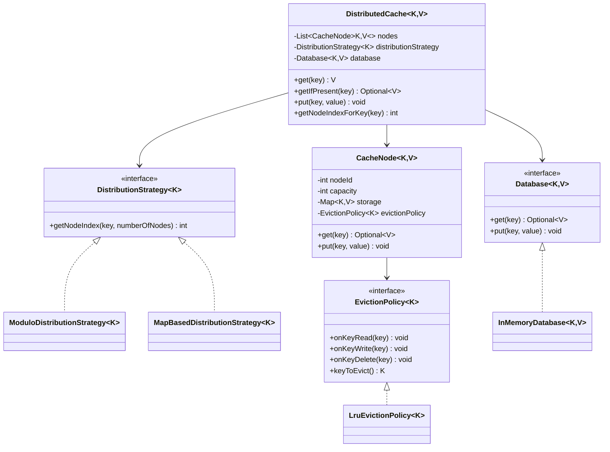

# Distributed Cache LLD Demo

This module implements an in-memory distributed cache with configurable node count, pluggable key distribution strategy, and pluggable eviction policy.

## Assumptions

- Keys are unique.
- No real network communication is needed (single-process LLD simulation).
- `put(key, value)` uses **write-through** behavior in this implementation: cache and database are both updated.

## Class Diagram



## How Data Is Distributed Across Nodes

- `DistributedCache` delegates key placement to `DistributionStrategy<K>`.
- Current strategy options:
  - `ModuloDistributionStrategy`: `hash(key) % numberOfNodes`
  - `MapBasedDistributionStrategy`: explicit key-to-node map with fallback strategy
- Because routing is behind an interface, a future `ConsistentHashDistributionStrategy` can be added without changing core cache APIs.

## How Cache Miss Is Handled

`get(key)` flow:

1. Resolve node via distribution strategy.
2. Try reading from that node.
3. If missing, read from `Database`.
4. If DB has value, insert into cache node and return it.
5. If DB also misses, return `null`.

This is read-through behavior.

## How Eviction Works

- Every `CacheNode` has fixed `capacity`.
- On `put` of a new key when the node is full:
  - node asks `EvictionPolicy` for `keyToEvict()`
  - removes that key
  - inserts new key
- Current policy is `LruEvictionPolicy`:
  - key access order is tracked
  - least recently used key is evicted first

## Extensibility

- **Distribution extensibility**: Add new `DistributionStrategy` implementations (for example consistent hashing).
- **Eviction extensibility**: Add new `EvictionPolicy` implementations (for example MRU/LFU).
- **Storage/backing extensibility**: Replace `Database` implementation without changing `DistributedCache`.

## Build

From module root (`distributed-cache`):

```bash
javac src/com/example/distributedcache/*.java
```

## Run Demo

```bash
java -cp src com.example.distributedcache.App
```
