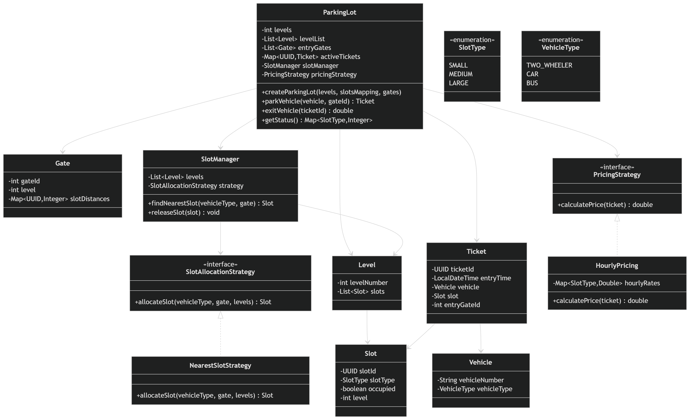

# Parking Lot LLD Demo

This module demonstrates a low-level design for a Parking Lot system using Java packages and a modular class structure.

## UML Diagram (Schema View)




## LLD Design

- Strategy pattern is used in two places:
  - `SlotStrategy` for pluggable slot allocation logic.
  - `PriceStrategy` for pluggable billing policies.
- `ParkingLot` is a service facade coordinating ticket lifecycle, pricing, and slot release.
- `SlotManager` encapsulates slot inventory operations so `ParkingLot` remains focused on flow.
- Domain entities (`Ticket`, `Slot`, `Vehicle`, `Gate`) are simple state carriers used by services.

## What Is Implemented

- Package-based Java design with separated responsibilities (entrypoint, domain models, and services)
- End-to-end demo flow through a main application class
- Multi-file, package-oriented codebase suitable for extension and testing

## Project Structure

- `src/com/example/...` contains implementation classes
- `README.md` contains setup, run, and design notes

## Compile

From project root (`parking-lot`):

```bash
javac src/com/example/parking_lots/*.java
```

PowerShell alternative:

```powershell
Get-ChildItem -Path src\com\example\parking_lots -Filter *.java | ForEach-Object { javac $_.FullName }
```

## Run Demo

Run the application with its fully qualified class name (replace package/class if different in your source):

```bash
java src.com.example.parking_lots.Application
```

## Notes

- This is a multi-file packaged Java project, so `java SomeFile.java` is not the right execution mode.
- Always compile source files first, then run with classpath + fully qualified class name.
