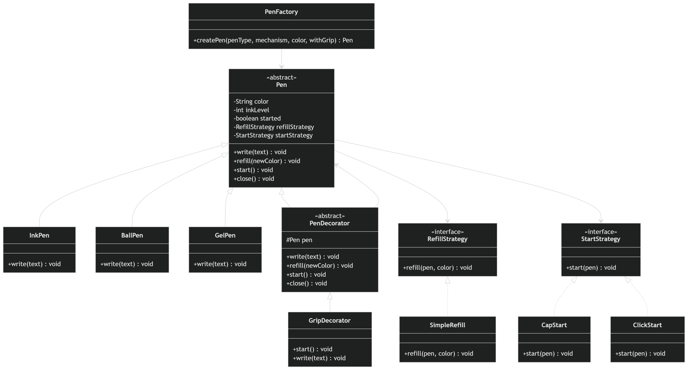

# Pen LLD Demo

This module implements a flexible Pen design using LLD with Strategy + Decorator patterns, aligned to your UML.

## UML Diagram (Schema View)




## LLD Design

- Decorator pattern:
  - `PenDecorator` wraps a `Pen` and forwards all behavior.
  - `GripDecorator` augments start/write without changing base pen classes.
- Strategy pattern:
  - `StartStrategy` handles cap vs click mechanism.
  - `RefillStrategy` handles refill behavior and color update.
- Base abstraction (`Pen`) enforces lifecycle and constraints:
  - `start()` must be called before `write()`.
  - refill resets ink to 100%.
  - concrete pens provide distinct write behavior.

## What Is Implemented

- Core behaviors:
  - `write(String text)`
  - `refill(String color)`
  - `start()`
  - `close()`
- Functional constraints:
  - `start()` is mandatory before `write()`
  - `write()` behavior differs by pen type
  - `refill()` behavior differs by pen type
  - every refill restores ink to `100%`
- Variations supported:
  - Pen types: `InkPen`, `BallPen`, `GelPen`
  - Mechanisms: `CapStart`, `ClickStart`
  - Color: active color can change during refill
  - Optional decorator: `GripDecorator`

## UML Mapping

- `Pen` (abstract)
  - fields: `color`, `refillStrategy`, `startStrategy`, `started`, `inkLevel`
  - methods: `write`, `refill`, `start`, `close`
- `RefillStrategy` (interface)
  - `SimpleRefill`
- `StartStrategy` (interface)
  - `CapStart`
  - `ClickStart`
- `PenDecorator` (abstract, wraps `Pen`)
  - `GripDecorator`
- Concrete pens:
  - `InkPen`
  - `BallPen`
  - `GelPen`
- `PenFactory` builds a pen from user-selected type + mechanism + decorator option

## Behavior Notes

- `write()` style and ink consumption differ across pen types.
- `refill()` always resets ink to full and can optionally update color.
- Refill post-actions are customized per pen type.

## Build & Run

From project root (`pen`):

```bash
javac src/com/example/pen/*.java
java -cp src com.example.pen.App
```

## Sample Input

- pen type: `gel`
- mechanism: `click`
- initial color: `blue`
- grip decorator: `yes`
- refill color: `black`

The app demonstrates validation, start-before-write rule, pen-specific writing, refill flow, and close behavior.
