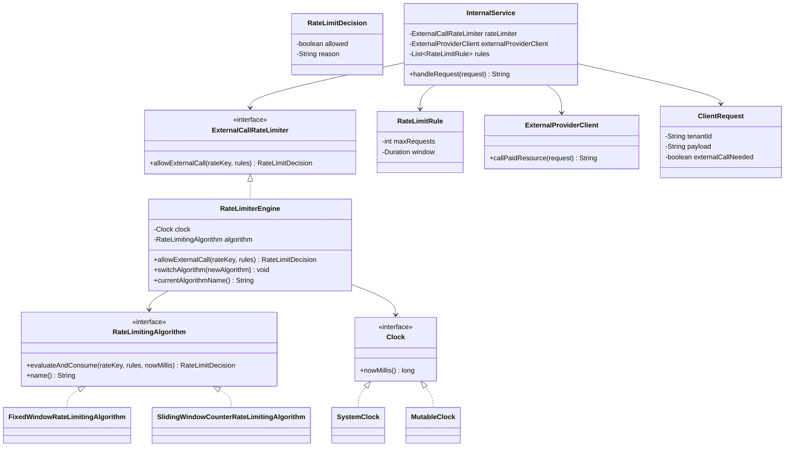

# Pluggable Rate Limiting System for External Resource Usage

This module demonstrates a pluggable, thread-safe rate limiting design that is applied only when the system is about to call a paid external provider.

## Problem Focus

- Rate limiting is **not** applied at API ingress.
- Internal business logic executes first.
- Only if business logic decides to call external provider, rate limiter is consulted.

## Class Diagram



## Key Design Decisions

1. Strategy Pattern for algorithm pluggability
- `RateLimitingAlgorithm` is the extension point.
- `RateLimiterEngine` can switch algorithm at runtime using `switchAlgorithm(...)`.
- Business logic (`InternalService`) remains unchanged.

2. Clean separation of concerns
- `InternalService` owns business flow.
- `RateLimiterEngine` is orchestration + validation.
- Algorithm classes own state and admission logic.

3. Thread safety
- Each algorithm keeps concurrent maps for states.
- Per-rate-key lock ensures atomic check-and-consume across multiple rules.
- This avoids partial consumption when one rule passes and another fails.

4. Multi-rule support
- The same key can enforce multiple limits together, for example:
  - `5 / minute`
  - `1000 / hour`
- A request is allowed only when all configured rules pass.

5. Testability
- `Clock` abstraction allows deterministic simulation (`MutableClock`) in tests/demo.

## Implemented Algorithms

1. Fixed Window Counter
- Time is partitioned into fixed buckets.
- Counter resets at bucket boundary.
- Fast and simple.

2. Sliding Window Counter
- Tracks current and previous window counters.
- Uses weighted contribution from previous window for smoother limiting.
- Reduces boundary burstiness compared to fixed window.

## Trade-offs: Fixed Window vs Sliding Window Counter

- Accuracy:
  - Fixed window is coarse near boundaries (can allow bursts around window edges).
  - Sliding counter is smoother and closer to real rolling windows.

- Complexity:
  - Fixed window is easier to reason about and implement.
  - Sliding counter is moderately more complex due to weighted estimation.

- Resource usage:
  - Both are memory efficient (`O(number_of_keys * number_of_rules)`).
  - Sliding counter does a bit more arithmetic per call.

## How to Add New Algorithms

Add a class implementing `RateLimitingAlgorithm` (for example token bucket), then inject/switch in `RateLimiterEngine`. No changes required in `InternalService`.

## Example Use Case Mapping

For tenant `T1`, configure:

- `5 requests per minute`
- `1000 requests per hour`

`InternalService.handleRequest(...)` flow:

1. Run business logic.
2. If `externalCallNeeded == false`, return directly (no quota consumed).
3. If external call is needed, compute rate key, for example `tenant:T1|provider:payments`.
4. Ask `rateLimiter.allowExternalCall(...)`.
5. If allowed, call external provider; otherwise reject gracefully.

## Build

From module root (`pluggable-rate-limiter`):

```bash
javac src/com/example/ratelimiter/*.java
```

## Run

```bash
java -cp src com.example.ratelimiter.App
```
