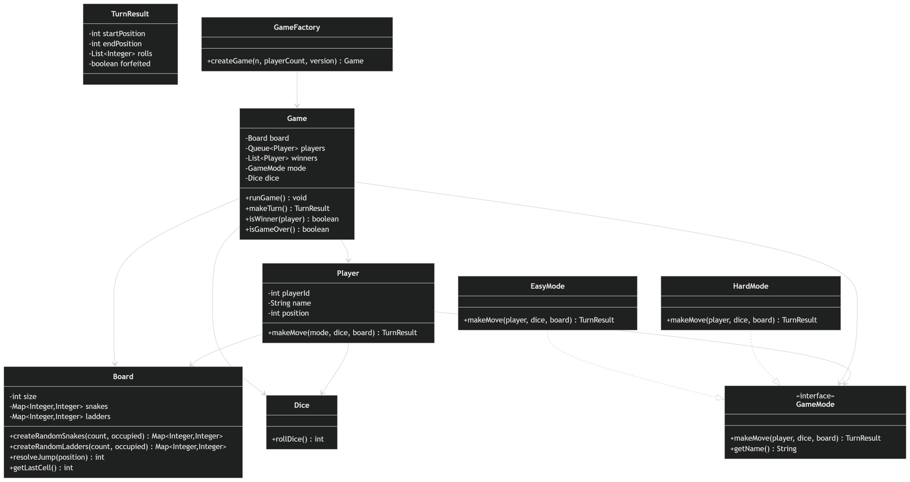
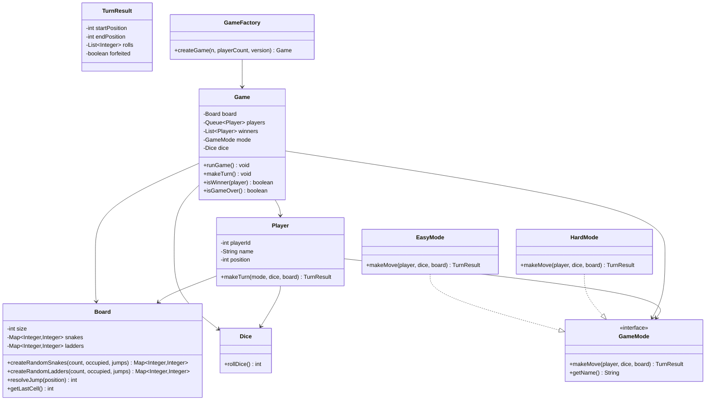

# Snake and Ladder LLD Demo

This module implements a Snake and Ladder game using object-oriented LLD and follows the provided UML structure.

## UML Diagram (Schema View)



## Class Diagram (Code-Level)



## LLD Design

- `Game` is the orchestrator and owns the turn queue, board, dice, and game mode strategy.
- Strategy pattern is used with `GameMode` to support easy and hard rules without changing `Game`.
- `Board` encapsulates random snake/ladder generation and jump resolution, including constraints.
- `TurnResult` captures roll sequence + result of a turn, making turn flow explicit and testable.
- `GameFactory` centralizes object construction from input parameters (`n`, `x`, `version`).

## What Is Implemented

- Factory-based game creation using 3 inputs: `n`, `x`, and `version`
  - `n`: board dimension (`n x n`)
  - `x`: number of players
  - `version`: `easy` or `hard`
- `Board` with random placement of:
  - `n` snakes (head > tail)
  - `n` ladders (start < end)
- Board constraints enforced:
  - Jumps are not on the same horizontal line (row)
  - No snake/ladder endpoint overlap
  - No jump cycles
- Multi-player turn queue (`Queue<Player>`) with automatic turn identification
- Two game modes via `GameMode` strategy:
  - `EasyMode`: continue rolling on every six
  - `HardMode`: on third consecutive six, the turn is forfeited
- Rule engine support:
  - Start from position `0`
  - Overshoot beyond last cell: no movement for that roll
  - Snake and ladder resolution on landing
  - Winner when a player reaches `n^2`
  - Game stops when fewer than 2 players remain in play

## Class Mapping to UML

- `GameMode` (interface)
  - `EasyMode`
  - `HardMode`
- `Game`
  - `Board board`
  - `Queue<Player> players`
  - `GameMode mode`
  - `Dice dice`
  - Methods: `runGame()`, `isWinner()`, `makeTurn()`
- `Board`
  - `size`, `snakes`, `ladders`
  - Methods: `createRandomSnakes()`, `createRandomLadders()`, `resolveJump()`
- `Player`
  - `playerId`, `name`, `position`
  - Method: `makeTurn()`
- `Dice`
  - Method: `rollDice()`
- `GameFactory`
  - Creates game using input parameters

## Run

From project root (`snakes-and-ladders`):

```bash
javac src/com/example/snakeladder/*.java
java -cp src com.example.snakeladder.App
```

## Sample Input

- `n = 10`
- `x = 3`
- `version = hard`

The app prints board setup, each turn detail, winner events, and final summary.
